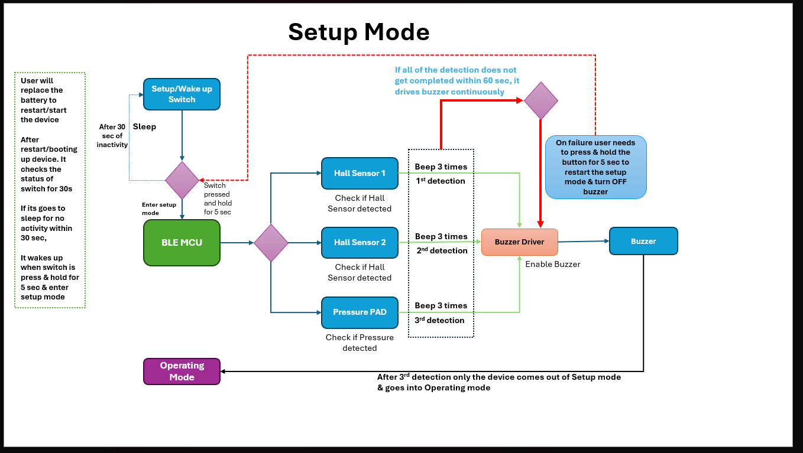
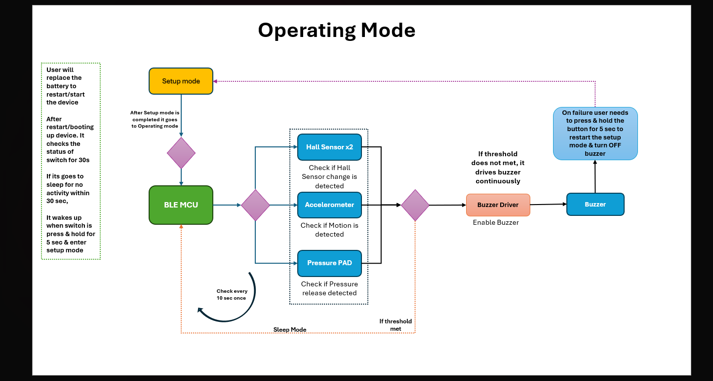

# NORDIC-safety-buckle for nrf52840

## Development Status

### Completed
- [x] BLE communication verified using UART and nRF Connect application
- [x] Hall sensor functionality verified using an external PWM signal
- [x] 10-second sleep application logic verified using `APP_TIMER` and `NRF_LOG`
- [x] MC3635 accelerometer driver development completed
- [x] Implement MC3635 accelerometer application logic on real hardware
- [x] Verify accelerometer data and overall integration
- [x] Support NRF LOG with UART
- [x] Support pressure sensor with ADC
- [x] Support Setup Button
- [x] Support for Setup Mode and Operation Mode

#### Setup Mode

#### Operating Mode

### Pending
- [ ] System Testing on product

